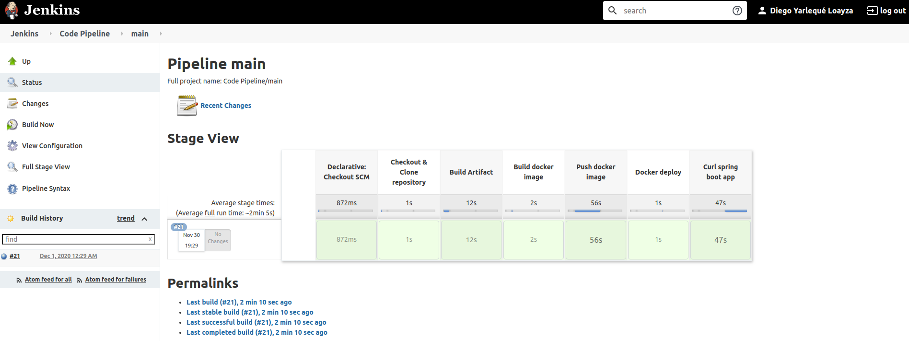

# code-challenge-fis

# Jenkins Installation steps

1. Create a custom jenkins container as follows:

    ```
    FROM jenkins/jenkins:lts
    USER root
    RUN apt-get -y update && \
        apt-get install -y bash curl openrc git
    RUN curl -fsSLO https://get.docker.com/builds/Linux/x86_64/docker-17.04.0-ce.tgz \
      && tar xzvf docker-17.04.0-ce.tgz \
      && mv docker/docker /usr/local/bin \
      && rm -r docker docker-17.04.0-ce.tgz
    USER jenkins
    EXPOSE 8080
    ```
   
2. Build the docker image as follows:
    
    ```
    docker build -t jenkins .
    ```

3. Based on previous built image, run a docker container as follows:

    ```
    docker run -d --name=jenkins -v /var/run/docker.sock:/var/run/docker.sock -p 8080:8080 -p 50000:50000 jenkins:latest
    ```

   ### NOTE
   The idea of this previous step is to be able to execute docker commands inside jenkins container.

   
4. Execute Jenkins locally as follows:

     ```
     http://localhost:8080
     ```

---
# Jenkins configuration

* Credentials configuration


    1. In jenkins main page, click on "Manage Jenkins"
    2. Select "Manage Credentials"
    3. Select "Jenkins"
    4. Select "Global credentials"
    5. Click on "Add Credentials"
    6. Choose "Username with password" option
    7. Fill in Username and Password (with a github account or similar)
    8. Fill in the id with a related name to the provided account type
    9. Optionally, fill in the "description field"
    10. Repeat the same steps for dockerhub authentication

* Pipeline creation

    After configuring our new jenkins user and plugins, log in with that account and
    do the following steps:
    
    
    1. In jenkins main page, click on "New Item"
    2. Select "Multibranch pipeline" and put it a name
    3. Select "Ok"
    4. In the pipeline configuration, choose a display name and description
    5. Select Branch sources and choose Git
    6. Fill in the git repository with the respective url
    7. Choose your git credentials (Credentials configuration)
    8. Click apply and then save
    9. After pipeline creation, choose it and select "Build Now" to execute it. 

---

# Repository & General Information

* Project Repo

    ```
    https://github.com/diego-yarleque/code-challenge-fis
    ```
  
* DockerHub Location

    ```
    https://hub.docker.com/repository/docker/dryloayza/code-challenge
    ```
  
* Pipeline Steps

    

* Pipeline Logs

    Pipeline logs are inside the code-challenge-fis repository. The file name is:

   ```
    jenkins-logs.txt
   ```
